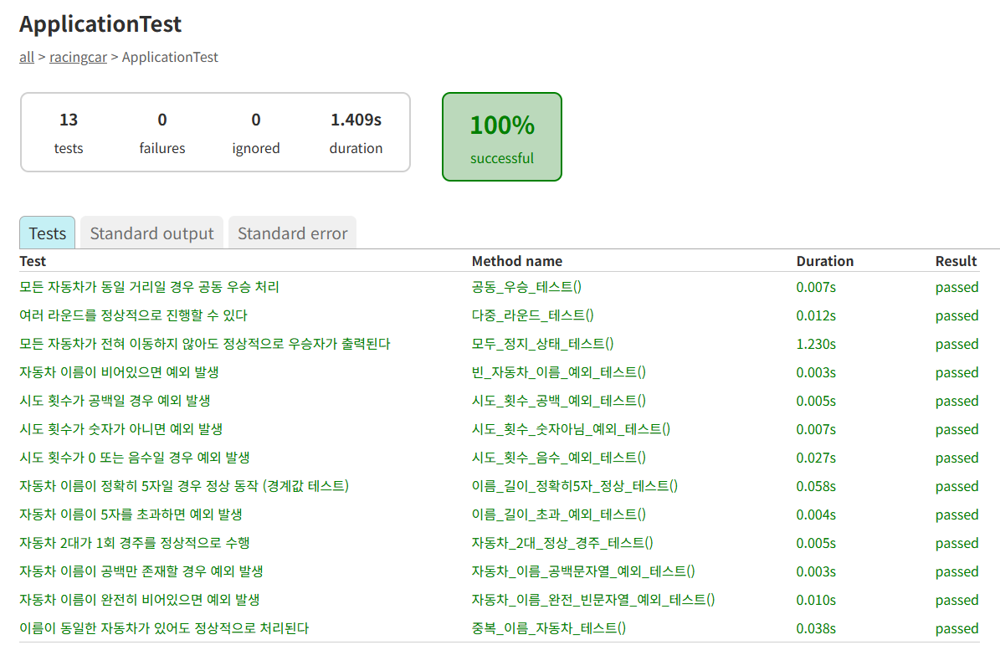

# java-racingcar-precourse

## 📌 기능 정리

1️⃣ 자동차 입력 기능
- 자동차 이름 입력 받기
- 쉼표를 기준으로 자동차 이름을 구분하기
- 자동차 이름을 5자 이하로 제한하기
- 예외 처리: 잘못된 입력시 IllegalArgumentException 발생

2️ 경주 진행 횟수 입력 기능
- 이동 횟수 입력받기
- 예외 처리: 잘못된 입력시 IllegalArgumentException 발생 (양수가 아니거나 정수형이 아닌 경우)

3️⃣ 랜덤 전진 기능
- 0~9 사이의 무작위 값 생성,  `Randoms.pickNumberInRange(0, 9)`
- 난수가 4이상인 경우 전진, 미만일 경우 멈춤

4️⃣ 자동차 전진 상태 출력 기능
- 형식에 맞춰서 자동차의 이름과 현재 위치를 함께 출력

5️⃣ 라운드 진행 기능
- 입력된 횟수만큼 반복하여 경주를 진행
- 각 라운드 마다 자동차들의 현재 상태를 출력

6️⃣ 우승자 판별 기능
- 가장 멀리 간 자동차를 우승자로 판별하기
- 공동 우승일 경우 쉼표(,)로 구분하여 출력하기

7️⃣ 테스트 코드 작성

---
## 📌 JUnit 5와 AssertJ를 활용하여 테스트하기
### 🎈 테스트 실행 방법 : `.\gradlew.bat clean test`
### 🎈 테스트 기능 목록 

### 🎈 JUnit 테스트 실행 결과 리포트(HTML 보고서)
-> gradlew test 명령으로 실행된 테스트 결과를 시각적으로 보여주는 HTML 페이지
-> Gradle이 JUnit 테스트를 실행할 때 자동으로 생성된다.

프로젝트 루트
└── build/
└── reports/
└── tests/
└── test/
└── index.html  ← 이 파일

-> .\gradlew.bat test  이 명령어 실행하면 모든 @Test 메서드 실행하고 결과를 콘솔에 출력하고 동시에 HTML 리포트 파일 생성
🔑 위의 HTML 리포트를 보고 실패한 테스트를 파악한 후 디버깅을 이용해서, 코드를 수정하였다.

---

## 📜 좋은 커밋 메시지 작성을 위한 7가지 약속 내용 정리 (English에 최적화)

1. 제목과 본문을 한 줄 띄워 분리하기
2. 제목은 영문 기준 50자 이내로
3. 제목 첫글자를 대문자로
4. 제목 끝에 `.` 금지
5. 제목은 `명령조`로
6. 본문은 영문 기준 72자마다 줄 바꾸기
7. 본문은 `어떻게`보다 `무엇을`, `왜`에 맞춰 작성하기

---

## 🔥 지켜야할 사항 피드백
미션 요구 사항을 정확하게 준수한다. (과제, 기능, 프로그래밍)

Git으로 관리할 자원을 고려하자!
-> .java파일만 있으면 javac 명령어로 .class 파일을 언제든지 만들 수 있기 때문에 .class는 관리할 필요 없음
-> IDE 관련 폴더도 제외 ( IntelliJ의 .idea/ 폴더 , Eclipse의 .metadata/ 폴더 -> 둘 다 개발 환경 설정을 저장하는 용도이다. 다른 환경에서 자동으로 다시 생성됨 📍.gitignore 알아보기

커밋 메시지 의미 있게 작성하기!
-> 해당 커밋에서 어떤 작업을 했는지 이해할 수 있도록 커밋 메시지 작성하자
-> 좋은 커밋 메시지에 대한 글 참조(좋은 git 커밋 메시지를 위한 7가지 약속 글 있음)

배열 대신 컬렉션을 사용하자
-> 컬렉션(List, Set, Map 등)을 사용하면 다양한 API를 사용하여 데이터를 조작할 수 있다. 예를 들어 List에 "pobi" 값이 있는지 다음과 같이 확인할 수 있다.